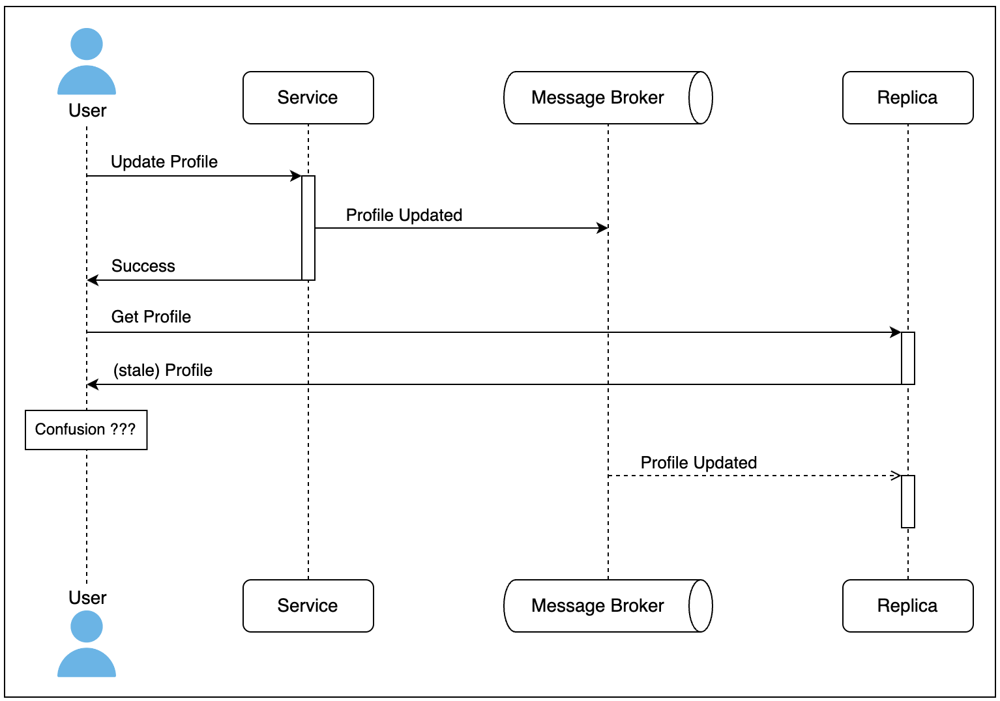
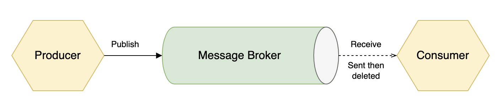
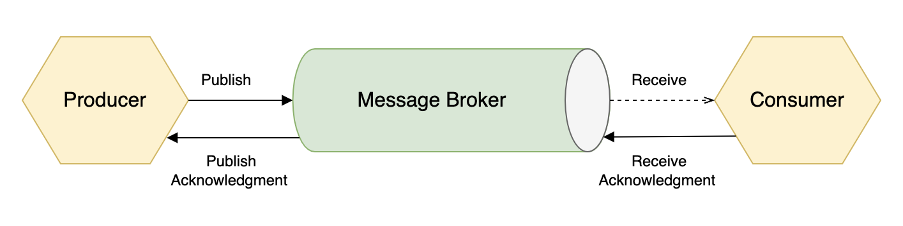
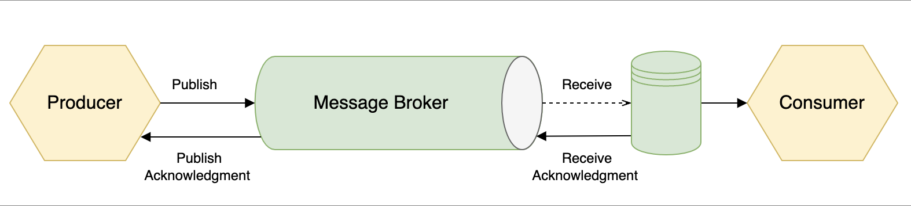

## What we need:
- building aggregator service
- consume from 7 services via message broker (kafka)
- aggregation data 

## Problem:
- handling high traffic
- handling message in order
- handling deduplicate message

## Solution:
### Integration with event-carried state transfer:
- Consumers are much less likely to need to make a request back to the producer for more information when they communicate with event-carried state transfer. State transfer is great for interested consumers to build a local representation of the data so that it may handle future requests independently.

Some uses for event-carried state transfer are presented here:

- Storing shipping addresses for customers in a warehouse service.
- Building a history of product purchases for a seller in an independent search component.
- Information from multiple producers can be combined to create entirely new resources for the application to support additional functionality.

The primary advantage of event-carried state transfer is that consumers are temporally decoupled from producers. The availability of the producer is no longer a factor in how resilient the consumer will be when handling requests that it receives.

### Eventually consistency:
- An eventually consistent system that has stopped receiving modifications to an item will eventually return the same last update across the system.
- In distributed applications and especially in event-driven applications. It is a trade-off made for the performance and resiliency gains when choosing to architect a system with asynchronous communication patterns.

### Message Delivery Guarantees

- **At-most-once message delivery**

  The producer does not wait for an acknowledgment from the message broker when it publishes a message under the at-most-once delivery model, as depicted in the following diagram:

  Message deduplication and idempotency are not concerns. However, the possibility that the message never arrives is very real. In addition to the producer not confirming that the message broker received the message, the broker does not wait for any acknowledgment from the consumer before it deletes the message. If the consumer fails to process the message, then the message will be lost.
- **At-least-once message delivery**
  With at-least-once delivery, the producer is guaranteed to have published the message to the message broker, and then the broker will keep delivering the message to the consumer until the message broker has received an acknowledgment that the message has been received, as depicted in the following diagram:

  A consumer can receive the message more than once, and they must be utilizing either message deduplication or have implemented other idempotency measures to ensure that the redelivery of a message does not result in it being processed more than once.
The reasons why a message might be delivered more than once can vary, but it will often be because the message broker is waiting a limited amount of time for an acknowledgment from the consumer. If the consumer takes too long to send an acknowledgment, then the message is re-queued to be sent again. Systems that can deduplicate messages so that repeated deliveries only result in one processing instance are the ideal use case for at-least-once delivery.
- **Exactly-once message delivery**
  Having a guarantee that a message will arrive exactly once is not so simple. As with the at-least-once delivery guarantee, the producer will wait for an acknowledgment from the broker. Also, the broker will keep delivering the message until it has received an acknowledgment from the receiver, as depicted in the following diagram:

  What is different now is that what received the message was not the consumer but instead an additional component that holds a copy of the message. The message can then be read, processed, and deleted by the consumer. That is at least the idea of how exactly-once delivery can be achieved, but network reliability and issues with the message broker or with the message store can all still cause the process to fail.

**Note:** Exactly-once delivery would be ideal for just about any situation, but it is extremely hard or downright impossible to achieve in most cases.
